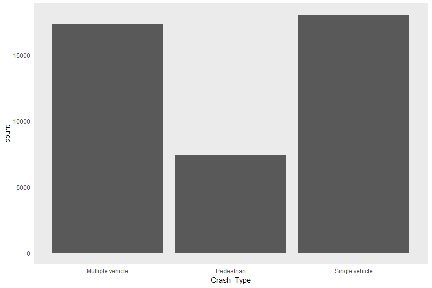
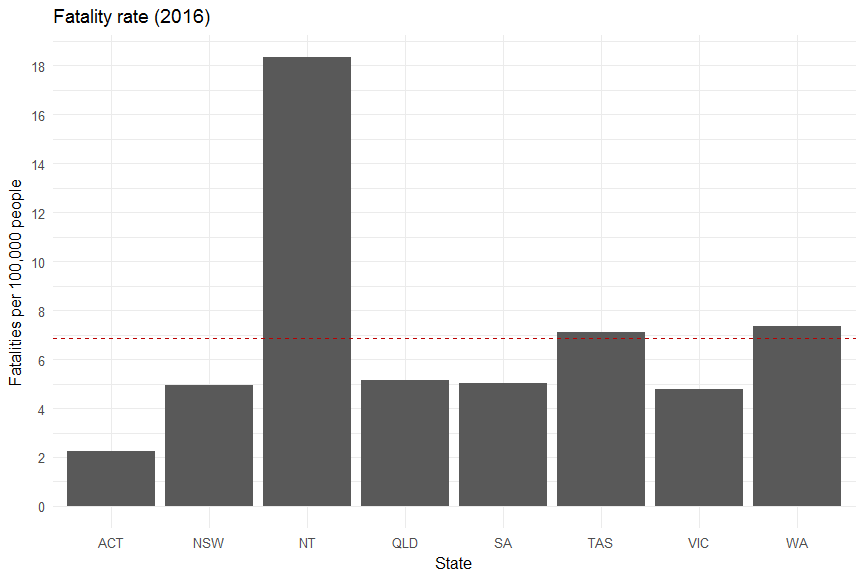
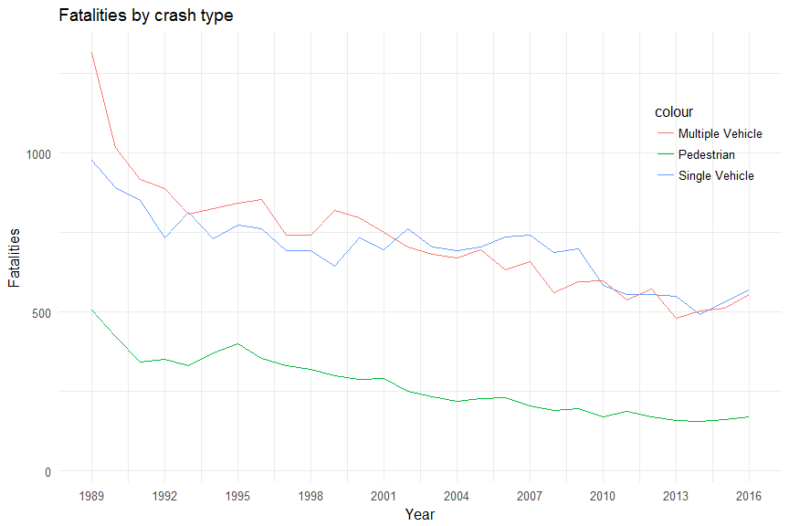
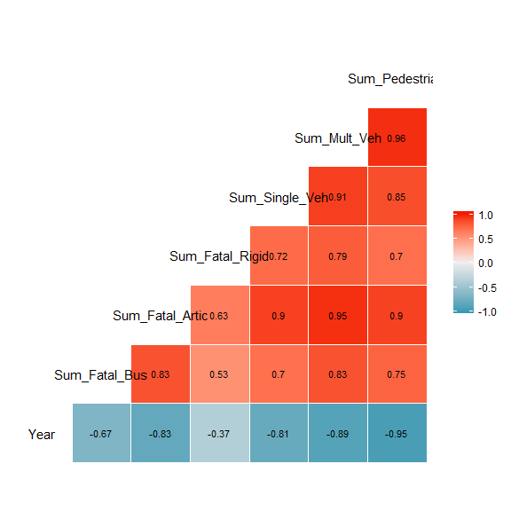
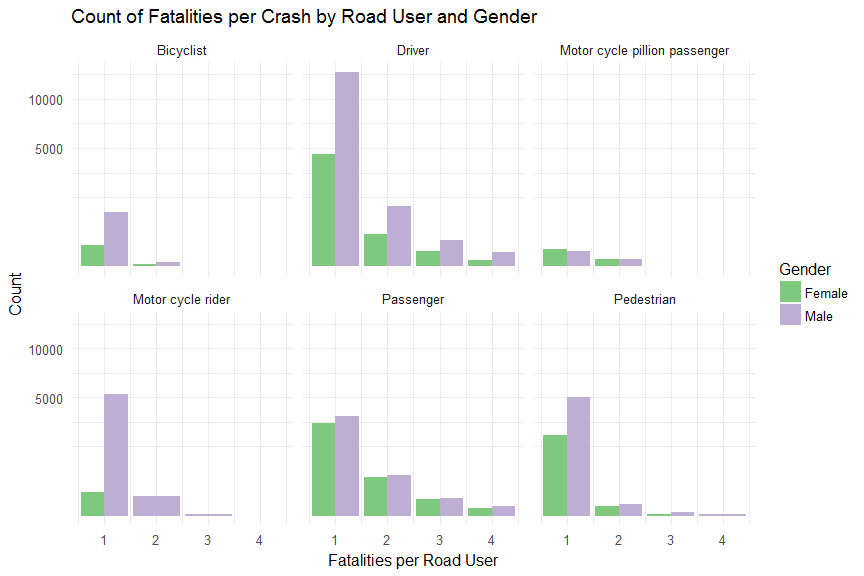

Exploratory Data Analysis of Australian Road Fatalities by Grant Chalmers
========================================================


### Data Description

The Australian Road Deaths Database (ARDD) is maintained and published by the
Bureau of Infrastructure, Transport and Regional Economics (BITRE).
It commenced in 1989 and is updated on a monthly basis.
The ARDD contains basic demographic and crash details of people who have died in
an Australian road crash. Every fatal road traffic crash in Australia is in
scope, and information is included for all people who were killed.

It is published in two forms:

* Fatalities: each record is a killed person
* Crashes: each record is a fatal crash

The database can be found [here](https://bitre.gov.au/statistics/safety/fatal_road_crash_database.aspx),
data dictionary can be found [here](https://bitre.gov.au/statistics/safety/files/ARDD_Dictionary_V3.pdf).

The data was already in a tidy format.

### Univariate Plots Section


```
## [1] 47632    16
```

```
## 'data.frame':	47632 obs. of  16 variables:
##  $ CrashID                      : num  1.2e+12 1.2e+12 1.2e+12 1.2e+12 1.2e+12 ...
##  $ State                        : Factor w/ 8 levels "ACT","NSW","NT",..: 2 2 2 2 2 2 2 2 2 2 ...
##  $ Day                          : int  1 1 1 1 2 2 2 5 6 6 ...
##  $ Month                        : Factor w/ 12 levels "April","August",..: 5 5 5 5 5 5 5 5 5 5 ...
##  $ Year                         : int  1989 1989 1989 1989 1989 1989 1989 1989 1989 1989 ...
##  $ Hour                         : int  14 14 14 14 9 14 17 7 5 16 ...
##  $ Minute                       : int  35 35 35 35 5 0 35 10 15 15 ...
##  $ Crash_Type                   : Factor w/ 3 levels "Multiple vehicle",..: 1 1 1 1 3 1 3 1 2 3 ...
##  $ Bus_Involvement              : Factor w/ 2 levels "No","Yes": 1 1 1 1 1 1 1 2 1 1 ...
##  $ Heavy_Rigid_Truck_Involvement: Factor w/ 3 levels "No","Unknown",..: 2 2 2 2 2 2 2 2 2 2 ...
##  $ Articulated_Truck_Involvement: Factor w/ 2 levels "No","Yes": 1 1 1 1 1 1 1 1 1 1 ...
##  $ Speed_Limit                  : int  80 80 80 80 60 100 100 60 100 100 ...
##  $ Road_User                    : Factor w/ 7 levels "Bicyclist","Driver",..: 2 6 6 2 2 2 6 2 7 6 ...
##  $ Gender                       : Factor w/ 3 levels "Female","Male",..: 2 2 1 2 2 2 1 2 2 1 ...
##  $ Age                          : int  28 2 10 24 26 33 3 22 67 70 ...
##  $ Number_of_Fatalities         : int  3 3 3 1 1 1 1 1 1 1 ...
```

```
##     CrashID              State            Day             Month      
##  Min.   :1.199e+12   NSW    :14800   Min.   : 1.00   December: 4291  
##  1st Qu.:1.201e+12   VIC    :10498   1st Qu.: 8.00   March   : 4238  
##  Median :2.201e+12   QLD    : 9356   Median :16.00   October : 4135  
##  Mean   :2.936e+12   WA     : 5557   Mean   :15.76   August  : 4015  
##  3rd Qu.:4.199e+12   SA     : 4105   3rd Qu.:23.00   November: 3995  
##  Max.   :8.202e+12   NT     : 1476   Max.   :31.00   May     : 3986  
##                      (Other): 1840                   (Other) :22972  
##       Year           Hour          Minute                 Crash_Type   
##  Min.   :1989   Min.   :-9.0   Min.   :-9.00   Multiple vehicle:20393  
##  1st Qu.:1994   1st Qu.: 8.0   1st Qu.: 0.00   Pedestrian      : 7552  
##  Median :2000   Median :14.0   Median :20.00   Single vehicle  :19687  
##  Mean   :2001   Mean   :12.7   Mean   :20.54                           
##  3rd Qu.:2008   3rd Qu.:18.0   3rd Qu.:35.00                           
##  Max.   :2017   Max.   :23.0   Max.   :59.00                           
##                                                                        
##  Bus_Involvement Heavy_Rigid_Truck_Involvement
##  No :46740       No     :19539                
##  Yes:  892       Unknown:26823                
##                  Yes    : 1270                
##                                               
##                                               
##                                               
##                                               
##  Articulated_Truck_Involvement  Speed_Limit    
##  No :42738                     Min.   : -9.00  
##  Yes: 4894                     1st Qu.: 60.00  
##                                Median : 80.00  
##                                Mean   : 92.27  
##                                3rd Qu.:100.00  
##                                Max.   :900.00  
##                                                
##                          Road_User         Gender           Age        
##  Bicyclist                    : 1247   Female :13666   Min.   : -9.00  
##  Driver                       :21358   Male   :33944   1st Qu.: 22.00  
##  Motor cycle pillion passenger:  344   Unknown:   22   Median : 33.00  
##  Motor cycle rider            : 5733                   Mean   : 39.08  
##  Other/unknown                :   63                   3rd Qu.: 54.00  
##  Passenger                    :11351                   Max.   :100.00  
##  Pedestrian                   : 7536                                   
##  Number_of_Fatalities
##  Min.   : 1.0        
##  1st Qu.: 1.0        
##  Median : 1.0        
##  Mean   : 1.3        
##  3rd Qu.: 1.0        
##  Max.   :35.0        
## 
```

```
## 
##  Female    Male Unknown 
##   13666   33944      22
```

The merged fatalities and crashes data set contains 47,632 observations and
16 variables. The key used to merge the two tables is **CrashID**. 


```
##    Min. 1st Qu.  Median    Mean 3rd Qu.    Max. 
##   1.000   1.000   1.000   1.114   1.000  35.000
```


```
##    Min. 1st Qu.  Median    Mean 3rd Qu.    Max. 
##   -9.00   60.00   80.00   90.68  100.00  900.00
```

```
## The number of speed limit zones greater 130 km/h is: 521
```

In the first plot above it is obvious that the vast majority of total fatalities
involved only one fatality. From the statistical summary below the maximum number
of fatalities in a single crash was 35. I decided to remove the extreme outliers
like this one to only include the most common crashes (0.999 quantile).

From the second plot it is clear that most fatalities occurred in the 60, 80,
100 & 110 km/h speed limit zones, which makes sense considering those are the
most common. I have included speed limit zones between 10 and 130km/h in this 
plot. I printed the number records where the speed limit zones were above 130.
These outliers consisted of 888, 777 & 900, which is not possible. I will ask
the provider of the data set what these represent, but for now I'm assuming they
are unknown speed limits or errors.


```
##    Min. 1st Qu.  Median    Mean 3rd Qu.    Max. 
##    1989    1994    2000    2001    2008    2017
```


```
##    Min. 1st Qu.  Median    Mean 3rd Qu.    Max. 
##   -9.00    8.00   14.00   12.72   18.00   23.00
```

In the first plot above there is a clear downward trend in Australian road
fatality numbers from 1989 to 2016, which is very favourable trend

Note: 2017 was excluded because it is not a full year of data.

The count of fatalities per hour show that most fatalities occur in the
afternoon peak hour. I expected to see a peak in the morning peak hour period as
well, however this was not the case. Unknown hour data (-9) has been removed
via x-axis scale limits.


```
##    Min. 1st Qu.  Median    Mean 3rd Qu.    Max. 
##   -9.00   22.00   34.00   39.68   55.00  100.00
```

The count of fatality age is skewed towards those in their late teens and early
twenties. This is not surprising considering younger drivers take more risks.

Note: the outliers for below the age of zero are assumed to be unborn babies.



Overall single vehicle and multiple vehicle crashes are the most common. There
are however, a lot less pedestrian fatalities but still more than I expected in
comparison to the other categories.


```
## The percentage of total fatalities involving: 
##  Bus: 1.68 
##  Heavy rigid truck: 2.65 
##  Ariticulated truck: 9.57
```

```
## The percentage of fatalities involving: 
##  Single vehicle: 42.14 
##  Pedestrian: 17.37 
##  Multiple vehicle: 40.49
```

The above percentages give an idea of the number of fatalities across Australian
roads comprising of:

* Heavy vehicle involvement, and
* Crash type

We will take a more in depth look at the trends later.

# Univariate Analysis


#### What is the structure of your dataset?
The merged fatalities and crashes data set (data frame) contains 47,632
observations and 16 variables. The key used to merge the two tables is
**CrashID**.
The only merged column is called **Number_of_Fatalities** and holds the total
fatalities per CrashID. This provides all the information in one data frame.
Care needs to be taken though, not to overstate the number of fatalities at this
value is repeated for each CrashID. Creating a new data frame with a unique
CrashID provides a versatile data set for comparing the number of fatalities.

#### What is/are the main feature(s) of interest in your dataset?
The main features of the data set are the number of fatalities along with
variables such as age, gender and state. All variables are useful except perhaps
minute.

#### What other features in the dataset do you think will help support your \
investigation into your feature(s) of interest?
Variables like hour, year, speed limit and road user provide good insights into
factors contributing to road fatalities.

#### Did you create any new variables from existing variables in the dataset?
fatal_unique is a subset of fatal, which removes duplicated CrashID records as
mentioned earlier. The fatal_unique data frame contains 42,765 observations and
16 variables. 

#### Of the features you investigated, were there any unusual distributions? \
Did you perform any operations on the data to tidy, adjust, or change the form \
of the data? If so, why did you do this?
For the univariate plots the overall improvement in the number of fatalities
from 1989-2016 was much better than I anticipated. The extreme spike in 
fatalities in the late teens and early twenties was also more pronounced than I
expected.

The main adjustment to the data was the merging of the two original csv files,
based on CrashID and the creation of fatal_unique. 
The fatal_unique data set allows accurate aggregation of the number of
fatalities. If more information is required regarding crashes, then the full
fatal data set was used.

Note: Missing values for numeric fields are coded with '-9';
for text fields the value is 'Unknown'. These are dealt by subsetting when
necessary, rather than complete removal to retain as much information as
possible.

# Bivariate Plots Section


```
##  [1] "State"                "Month"                "Year"                
##  [4] "Hour"                 "Crash_Type"           "Speed_Limit"         
##  [7] "Road_User"            "Gender"               "Age"                 
## [10] "Number_of_Fatalities"
```


The above scatter plot give a brief overview of the important variables and
assists in determining the variables that are worth exploring further.


The above plot is a correlation matrix which shows the correlation coefficients
between numeric variables in the data set. This plot tells me that in their
current form, the correlation coefficients are fairly benign and an aggregation
of Number_of_Fatalities may be required to tease out stronger correlations.


```
## fatal$Road_User: Bicyclist
##    Min. 1st Qu.  Median    Mean 3rd Qu.    Max. 
##   -9.00   16.00   35.00   37.18   54.00   93.00 
## -------------------------------------------------------- 
## fatal$Road_User: Driver
##    Min. 1st Qu.  Median    Mean 3rd Qu.    Max. 
##   -9.00   24.00   36.00   40.86   54.00   98.00 
## -------------------------------------------------------- 
## fatal$Road_User: Motor cycle pillion passenger
##    Min. 1st Qu.  Median    Mean 3rd Qu.    Max. 
##   -9.00   19.00   24.00   28.14   35.25   69.00 
## -------------------------------------------------------- 
## fatal$Road_User: Motor cycle rider
##    Min. 1st Qu.  Median    Mean 3rd Qu.    Max. 
##   -9.00   23.00   31.00   33.85   42.00   91.00 
## -------------------------------------------------------- 
## fatal$Road_User: Other/unknown
##    Min. 1st Qu.  Median    Mean 3rd Qu.    Max. 
##    -9.0    20.0    27.0    35.1    48.5    98.0 
## -------------------------------------------------------- 
## fatal$Road_User: Passenger
##    Min. 1st Qu.  Median    Mean 3rd Qu.    Max. 
##    -9.0    18.0    25.0    34.1    51.0    99.0 
## -------------------------------------------------------- 
## fatal$Road_User: Pedestrian
##    Min. 1st Qu.  Median    Mean 3rd Qu.    Max. 
##   -9.00   24.00   44.00   46.39   71.00  100.00
```


```
##  ACT  NSW   NT  QLD   SA  TAS  VIC   WA 
##  250 7989  619 5284 2250  819 5447 3135
```

```
## Number of drivers/rider fatalities under the legal driving age is 160
```

```
##     State
## Age  ACT NSW NT QLD SA TAS VIC WA
##   0    0   0  0   0  1   0   2  1
##   3    0   0  0   1  0   0   0  0
##   5    0   1  0   0  1   0   0  1
##   7    0   1  0   0  0   0   0  0
##   8    0   2  0   0  0   0   0  0
##   9    0   1  0   0  1   1   1  0
##   10   0   1  0   0  1   0   1  1
##   11   0   0  0   1  0   0   1  2
##   12   0   6  0   1  1   0   0  0
##   13   0   2  0   4  0   0   3  3
##   14   0  17  4   5  3   2   2  6
##   15   0  20  2  14  4   3  19 16
```

The above box plots look at age in a bit more detail.
The first box plot displays the age statistics for different road users it 
shows that motor cycle riders, motor cycle pillion and passenger ages are 
slightly lower than the others. The width of the box plot provides some insight
into the number in each category of road users. The road user category
"Other/unknown" has been removed.

The Age versus gender box plot indicates that the mean and median age of males
is lower which is intuitive because male drivers tend to take more risks, while 
female drivers are more defensive.

The third box plot above provides a succinct summary of ages across the different
state categories. I was surprised by the length of the lower whisker in many
plots, so I printed the number of drivers/motor cycle riders under the legal
driving age and a table of the breakdown

Note: Learner drivers may drive, under qualified supervision, from 15 years and
9 months in the Australian Capital Territory (ACT), however as per the table 
mentioned earlier, there were no fatalities in this range.


```
##    Min. 1st Qu.  Median    Mean 3rd Qu.    Max. 
##     1.0    73.5   209.0   301.8   449.5  1163.0
```

```
## 
## 	Pearson's product-moment correlation
## 
## data:  Age and Sum_Fatal_Driver_Bike_Age
## t = -19.055, df = 81, p-value < 2.2e-16
## alternative hypothesis: true correlation is not equal to 0
## 95 percent confidence interval:
##  -0.9371355 -0.8553433
## sample estimates:
##        cor 
## -0.9042154
```


```
##    Min. 1st Qu.  Median    Mean 3rd Qu.    Max. 
##    5844   10090   14340   14340   18580   22830
```

Driver and motor cycle rider fatalities were very high in the late teens and 
early twenties as shown in the univariate histogram. The peak is even more stark
when looking at the driver and motor cycle rider subset, as opposed to all
fatalities. There is a strong negative correlation between the age and
driver/rider fatalities over the age of 15 years. Age explains 90 percent of the
decline in fatalities for this particular data set.

There is a massive discrepancy between gender, with most driver and motor cycle
riders being male.


```
##    Min. 1st Qu.  Median    Mean 3rd Qu.    Max. 
##     637    1037    1078    1193    1350    1930
```

```
##    Min. 1st Qu.  Median    Mean 3rd Qu.    Max. 
##   -9.00    8.00   13.00   12.52   17.00   23.00
```

Similar to the count of fatalities per hour, the above driver and motor cycle
rider fatalities show that most fatalities occur in the afternoon peak
hour period. The peak is around 2pm - 6pm, which would incorporate school pickup
times.

The right-hand box plot shows the number of fatalities per crash, rather than
the sum as in the left-hand line plot. Fatalities of 1 to 3 people per crash are
quite consistent with higher fatality crashes more variable. The trend is the
same however with the bulk of median hours falling between early and late
afternoon.

Note: the x-axis of the box plot is factored scale and unknown hours (-9) have
been removed in both plots.


```
##    Min. 1st Qu.  Median    Mean 3rd Qu.    Max. 
##    2212    2268    2349    2389    2526    2576
```

No real surprises in the fatalities by month plot. There are in general, more
fatalities on months that contain 31 days and public holidays.
It would be interesting to break this down further to see what patterns exist in
different states.


```
## The 1989-2016 mean fatility rate is 9.203438 per 100,000 people
```

```
## 
## 	Pearson's product-moment correlation
## 
## data:  Fatal_Rate and Est_Pop_Density
## t = -1.1501, df = 6, p-value = 0.2939
## alternative hypothesis: true correlation is not equal to 0
## 95 percent confidence interval:
##  -0.8693298  0.3992159
## sample estimates:
##        cor 
## -0.4250231
```

The left-hand plot highlights a significant discrepancy in the fatality rate for
the NT as opposed to the rest of Australia and the mean as depicted by the red
dashed line.
This is somewhat unexpected, but could be related to factors such as road
infrastructure and associated funding, a higher proportion of country roads,
a higher proportion of drink driving and/or not wearing seat belts.

The right-hand plot shows the relationship between population density and
fatality rate. The ACT has by far the highest population density at 170 people
per sq km, this compares to 0.2 per sq km in the NT. Fatality rates appear to be
negatively correlated with population density. As population density increases,
the fatality rate decreases. 

Note: the y-axis on the right-hand panel has been transformed using log10 to 
enable a more concise view of the trend.

The Pearson's correlation calculated above indicates that 42.5% of the fatality
rate is explained by estimated population density in this data set.

Population density is calculated based on ABS estimated population (link provided 
earlier) and land area for each state 
(Population Estimates by Statistical Area Level 2, 2005 to 2015) [here](http://www.abs.gov.au/AUSSTATS/abs@.nsf/DetailsPage/3218.02014-15?OpenDocument).



```
## The 2016 mean fatility rate is 6.87051 per 100,000 people
```

The Northern Territory (NT) is well over the mean as depicted by the red dashed
line and this has been the case throughout the data set timeline. This plot
shows 2016 only to confirm the pattern is similar in relation to the NT and
to determine the overall fatality rate improvement compared to the full data
set given in the previous plot.

The fatality rate in recent times has improved significantly, however the NT
still stands out in relation to the other states.

Note: the ABS estimated population data was collected in Sept 2016.


```
##    Min. 1st Qu.  Median    Mean 3rd Qu.    Max. 
##     263    1353    1627    1642    1928    2800
```

The Australian road fatalities trend from 1989 to 2016 is clearly downward with
a possible flattening out at the end, time will tell. 2017 is not included
because it is not a full year of data and would skew the trend lower. This line 
plot with smoothing provides an enhanced view of the trend compared to the
univariate histogram.


```
##    Min. 1st Qu.  Median    Mean 3rd Qu.    Max. 
##    30.0   145.0   171.0   168.8   191.0   335.0
```

The above plot shows the trend over time for fatalities involving articulated
trucks. This category represents the highest proportion of heavy vehicle related
fatalities as found previously. The trend here is downward, which is good. In
The multivariate section we will look at all three categories together.


```
##    Min. 1st Qu.  Median    Mean 3rd Qu.    Max. 
##   120.0   585.0   700.0   678.9   741.0   979.0
```

The above plot shows the trend over time for fatalities involving single
vehicles. This category represents the highest proportion of crash types as
found previously. The trend here is downward, which is good. In
The multivariate section we will look at all three categories together.

# Bivariate Analysis


#### Talk about some of the relationships you observed in this part of the \
investigation. How did the feature(s) of interest vary with other features in \
the data set?

Fatalities correlate with many variables the significant ones include gender,
age, time and state. Fatalities by gender are skewed heavily towards males.
There is a massive discrepancy in age where younger drivers are involved in more
accidents. Fatalities are declining over time, however there seems to be a
reversal in the last couple of years or at least a flattening out of the
preceding trend.

The NT stands out among the states as having by far the highest fatality rate.
The NT also has the lowest median and mean age when it comes to fatalities as 
depicted in the Age vs State box plot and these are most likely related.

#### Did you observe any interesting relationships between the other features \
(not the main feature(s) of interest)?

I created a supporting data frame from Australian Bureau of Statistics (ABS) data
for estimated resident population in order to look at the fatality rate per
100,000 people in each state. This provided a view on the NT state that was not
obvious by looking at the other variables on their own. It showed a much higher
fatality rate than the rest of the states in Australia.

The ABS data can be found [here](http://www.abs.gov.au/AUSSTATS/abs@.nsf/DetailsPage/3101.0Sep%202016?OpenDocument).
The data I required was a very small subset, so I manually pasted into a csv
file, then read this into a data frame.

#### What was the strongest relationship you found?
The strongest relationship is the number of fatalities versus age. Drivers and 
motor cycle riders in their late teens and early twenties have over five times
the fatalities compared to the median age of all ages. The gender variance is 
also very significant.

# Multivariate Plots Section


```
##       Year      Sum_Fatal_Bus    Sum_Fatal_Artic Sum_Fatal_Rigid 
##  Min.   :1989   Min.   :  6.00   Min.   : 30.0   Min.   : 13.00  
##  1st Qu.:1996   1st Qu.: 22.00   1st Qu.:145.0   1st Qu.: 74.75  
##  Median :2003   Median : 29.00   Median :171.0   Median : 81.50  
##  Mean   :2003   Mean   : 30.76   Mean   :168.8   Mean   : 79.38  
##  3rd Qu.:2010   3rd Qu.: 36.00   3rd Qu.:191.0   3rd Qu.: 88.50  
##  Max.   :2017   Max.   :104.00   Max.   :335.0   Max.   :108.00  
##                                                  NA's   :13
```

I have revisited the heavy vehicle involvement in more detail with the above
plot showing the number of fatalities from 1989-2016. This plot shows a vast 
improvement in articulated truck related fatalities over time. Heavy rigid truck
has remained constant and there has been an improvement in bus related
fatalities.

Information for heavy rigid truck involvement in crashes earlier than 2004 is
incomplete.



```
##       Year      Sum_Single_Veh   Sum_Mult_Veh    Sum_Pedestrian 
##  Min.   :1989   Min.   :120.0   Min.   : 117.0   Min.   : 26.0  
##  1st Qu.:1996   1st Qu.:585.0   1st Qu.: 573.0   1st Qu.:186.0  
##  Median :2003   Median :700.0   Median : 695.0   Median :233.0  
##  Mean   :2003   Mean   :678.9   Mean   : 703.2   Mean   :260.4  
##  3rd Qu.:2010   3rd Qu.:741.0   3rd Qu.: 819.0   3rd Qu.:331.0  
##  Max.   :2017   Max.   :979.0   Max.   :1316.0   Max.   :505.0
```

I have revisited the crash types in more detail with the above
plot showing the number of fatalities from 1989-2016. This plot shows a 
relatively uniform decline in the number of fatalities involving all 
crash types. All categories show a minor uptick from around 2015.



There is a positive correlation between the aggregated variables for the above
two line plots, while Year is negatively correlated because as the years
increase over the data set, each category of fatalities have
gone down. Heavy rigid truck has the lightest shading because this category has
the weakest improvement for the available data and therefore the weakest 
correlation.


```
##     Number_of_Fatalities
## Age    1   2   3   4   5   6   7  20
##   0    4   0   0   0   0   0   0   0
##   3    1   0   0   0   0   0   0   0
##   5    3   0   0   0   0   0   0   0
##   7    1   0   0   0   0   0   0   0
##   8    2   0   0   0   0   0   0   0
##   9    4   0   0   0   0   0   0   0
##   10   4   0   0   0   0   0   0   0
##   11   4   0   0   0   0   0   0   0
##   12   8   0   0   0   0   0   0   0
##   13  12   0   0   0   0   0   0   0
##   14  34   4   0   1   0   0   0   0
##   15  65  13   0   0   0   0   0   0
##   16 157  16   5   1   0   0   0   0
##   17 485  50  13   7   0   0   0   0
##   18 898  87  16   4   3   2   0   0
##   19 846  94  10   2   1   1   0   0
##   20 863  81  14   7   3   0   0   0
##   21 816  67  13   2   0   0   0   0
##   22 723  63  11   2   6   0   0   0
##   23 728  52   9   0   0   0   0   0
##   24 677  34  16   2   0   0   1   0
##   25 649  44  11   3   1   0   0   0
##   26 618  47  12   3   0   0   0   0
##   27 552  40  11   1   0   0   0   0
##   28 556  35  13   3   0   0   0   0
##   29 555  35   6   3   0   0   1   0
##   30 528  35  10   2   0   0   0   0
##   31 514  41   7   0   0   2   0   0
##   32 507  29   7   1   1   1   0   0
##   33 478  34   3   1   1   0   0   0
##   34 454  21   4   0   1   0   0   1
##   35 424  25   5   1   2   0   0   0
##   36 475  30   8   7   2   0   0   0
##   37 394  29   2   1   0   0   0   0
##   38 370  30   7   0   0   0   0   0
##   39 402  23   4   2   1   0   0   0
##   40 417  38   6   3   0   0   0   0
##   41 371  23   6   2   1   0   0   0
##   42 337  27   5   3   0   0   0   0
##   43 350  17   3   4   0   0   0   0
##   44 310  25   8   0   0   0   0   0
##   45 323  27   2   1   0   1   0   0
##   46 334  17   4   1   0   0   0   0
##   47 310  24   4   0   0   0   0   0
##   48 288  26   6   2   1   0   0   0
##   49 303  27   2   1   0   0   0   0
##   50 298  26   3   1   0   0   0   0
##   51 270  20   4   2   1   0   0   0
##   52 243  13   4   1   0   0   0   0
##   53 262  15   0   2   0   0   0   0
##   54 245  21   5   0   0   0   0   0
##   55 235  16   1   1   0   0   0   0
##   56 236  12   0   1   0   0   0   0
##   57 215   7   3   0   0   0   0   0
##   58 193  16   1   0   1   0   0   0
##   59 216  12   5   0   0   0   0   0
##   60 188  18   2   0   0   0   0   0
##   61 195  16   4   0   0   0   0   0
##   62 180  17   1   1   0   0   0   0
##   63 163  20   2   0   0   0   0   0
##   64 164  15   0   0   0   0   0   0
##   65 182   8   3   0   1   0   0   0
##   66 171  10   1   0   0   0   0   0
##   67 164   9   3   1   0   0   0   0
##   68 148  14   4   1   0   0   0   0
##   69 159  12   0   0   0   0   0   0
##   70 142  16   2   1   0   0   0   0
##   71 115  14   0   0   0   0   0   0
##   72 146   8   1   0   0   0   0   0
##   73 148  13   0   1   0   0   0   0
##   74 115  15   1   1   0   0   0   0
##   75 141   6   2   0   0   0   0   0
##   76 161  17   1   0   0   0   0   0
##   77 140  11   0   1   0   0   0   0
##   78 132   9   1   0   0   1   0   0
##   79 129   9   2   1   0   0   0   0
##   80 131  15   0   0   0   0   0   0
##   81 109   7   2   0   0   0   0   0
##   82 111   5   1   0   0   0   0   0
##   83  80   7   0   0   0   0   0   0
##   84  88  12   0   0   0   0   0   0
##   85  64   4   0   0   0   0   0   0
##   86  66   4   0   0   0   0   0   0
##   87  67   3   0   0   0   0   0   0
##   88  47   1   0   0   0   0   0   0
##   89  31   2   0   0   0   0   0   0
##   90  35   1   0   0   0   0   0   0
##   91  20   1   0   0   0   0   0   0
##   92  19   2   0   0   0   0   0   0
##   93  15   0   0   0   0   0   0   0
##   94   8   0   0   0   0   0   0   0
##   95   2   0   0   0   0   0   0   0
##   96   5   1   0   0   0   0   0   0
##   97   4   0   0   0   0   0   0   0
##   98   2   0   0   0   0   0   0   0
```

The above box plot shows the number of driver and motor cycle rider 
fatalities by gender and age. The box plot does a good job of showing the
distribution of gender and age for each fatality group. There appears to be a 
gradual decline in median age as the number of fatalities increases, which could
indicate that the experience of the driver is playing a part. AS we saw earlier,
when looking at aggregated fatalities, there is a strong negative correlation of
over 90%.

The median age is lower for males in all plots, which is consistent with the
trends we have seen so far.


```
##                                Number_of_Fatalities
## Road_User                           1     2     3     4     5     6     7
##   Bicyclist                         0     0     0     0     0     0     0
##   Driver                        18041  1652   321    89    27     8     2
##   Motor cycle pillion passenger     0     0     0     0     0     0     0
##   Motor cycle rider              5513   138     1     0     0     0     0
##   Other/unknown                     0     0     0     0     0     0     0
##   Passenger                         0     0     0     0     0     0     0
##   Pedestrian                        0     0     0     0     0     0     0
##                                Number_of_Fatalities
## Road_User                          20
##   Bicyclist                         0
##   Driver                            1
##   Motor cycle pillion passenger     0
##   Motor cycle rider                 0
##   Other/unknown                     0
##   Passenger                         0
##   Pedestrian                        0
```

When drilling down to road user it is quite obvious that males are younger in
both categories and that multiple fatality crashes involving motor cycle riders
are less common. The table above shows the number of fatalities 
broken down by road user. Only drivers & motor cycle riders have values because
we are analysing a subset for these values.


```
##    Min. 1st Qu.  Median    Mean 3rd Qu.    Max. 
##     1.0    36.5    87.5   157.5   179.8   924.0
```


```
##    Min. 1st Qu.  Median    Mean 3rd Qu.    Max. 
##    77.0   249.5   519.0   596.7   915.2  1446.0
```

The first plot effectively highlights the difference in gender, particularly in
the early years of driving/riding. Based on this plot it is apparent women are
safer drivers until advanced ages are reached.

The second plot shows the difference between fatalities by hour and gender. As
expected male fatalities are significantly higher at all times of the day.
For gender, both patterns are the same with more pronounced peaks and troughs
for males. There seems to be two small peaks for females around school drop-off
and pick-up times.



The first plot shows the count of fatalities per road user type and gender. This
shows that drivers make up the majority of fatalities and males dominate the
gender difference. What I found most striking about this plot is that even for
pedestrians, males make up most of the fatalities, which suggests that males
take more risks as pedestrians also. The only road user category that had a
relatively even distribution of gender was passengers. The y-axis has a sqrt
transformation so the trends can be viewed more easily.

The second plot shows the count of fatalities per crash type and gender. It is
interesting that there are more fatalities in the  100km/h zone compared to the
110km/h zone, however this is most likely due to there being a lot more 100km/h
zones. Also, 100km/h zones are more likely to be closer to metropolitan areas
and therefore used more frequently.
There are a higher proportion of pedestrian deaths in the 60km/h zones, which 
makes sense. Single vehicle fatalities make up a greater proportion as speed
limits increase, while pedestrian deaths decrease. The y-axis has a sqrt
transformation so the trends can be viewed more easily.


```
##    Min. 1st Qu.  Median    Mean 3rd Qu.    Max. 
##     2.0    49.0   165.5   205.3   330.0   959.0
```

The plot above shows the number of fatalities per year split by state. Here we
can see a downward trend in every state, although some trends are more
consistent than others. The ACT, NT and TAS seem to be more variable, whereas,
NSW, VIC and SA look more smooth and linear.

Note: the y scale is different for each plot based on population and fatalities.


```
## 
## 	Pearson's product-moment correlation
## 
## data:  Year and Sum_Fatal
## t = -13.296, df = 26, p-value = 4.176e-13
## alternative hypothesis: true correlation is not equal to 0
## 95 percent confidence interval:
##  -0.9691720 -0.8602972
## sample estimates:
##        cor 
## -0.9336974
```

```
## 
## Call:
## lm(formula = Sum_Fatal_State_Yr ~ Year + State, data = subset(sum_fatal_state_yr, 
##     Year != 2017))
## 
## Residuals:
##     Min      1Q  Median      3Q     Max 
## -157.87  -28.60   -1.73   22.11  361.78 
## 
## Coefficients:
##               Estimate Std. Error t value Pr(>|t|)    
## (Intercept) 10617.4503   917.6076  11.571  < 2e-16 ***
## Year           -5.2942     0.4582 -11.554  < 2e-16 ***
## StateNSW      510.0000    14.8049  34.448  < 2e-16 ***
## StateNT        36.6786    14.8049   2.477   0.0140 *  
## StateQLD      316.3929    14.8049  21.371  < 2e-16 ***
## StateSA       130.2143    14.8049   8.795 4.68e-16 ***
## StateTAS       33.9643    14.8049   2.294   0.0227 *  
## StateVIC      357.1071    14.8049  24.121  < 2e-16 ***
## StateWA       181.3929    14.8049  12.252  < 2e-16 ***
## ---
## Signif. codes:  0 '***' 0.001 '**' 0.01 '*' 0.05 '.' 0.1 ' ' 1
## 
## Residual standard error: 55.39 on 215 degrees of freedom
## Multiple R-squared:  0.9133,	Adjusted R-squared:  0.9101 
## F-statistic: 283.2 on 8 and 215 DF,  p-value: < 2.2e-16
```

The Pearson's correlation of -0.93 calculated above means that the number of
fatalities and year are strongly negatively correlated. In other words, as the 
year increases the number of fatalities goes down.

The linear model takes in number of fatalities, year and the categorical
variable state. The R-squared value is 0.91 which is high and this is 
evaluated as being a good fit. The last column of the table is the probability 
the variables are not relevant. These values are very low as signified by 
R using scientific notation. The NT & TAS have the highest value, SA has the
lowest value. When visualising the last plot SA does in fact appear to be the
most linear, while the NT and TAS show more variance with a thicker grey area
around the smoothing line. 

Note: when fitting a regression with a categorical variable, one option must be
left out to avoid over-fitting the model, in this case it is the ACT.

The strength in this linear regression model is that fatality rates have been
going down in a relatively linear fashion in the last 27 years. Also, one of the 
variable is linear in nature (year), which provides assistance to the linear 
nature of this data.
The limitation is that these trends could change and it is unlikely fatality
rates will keep going down because this would mean reaching zero at some point
in the future, which is virtually impossible while humans are behind the wheel.

Autonomous vehicles will eventually reduce the fatality rate below what is
possible with human drivers but not to zero. Due to this limitation there is 
little value in trying to predict fatality rates into the future.


# Multivariate Analysis

#### Talk about some of the relationships you observed in this part of the \
investigation. Were there features that strengthened each other in terms of \
looking at your feature(s) of interest?

The downward trend in fatalities was highlighted in the fatalities involving 
heavy vehicles and crash types. These plots also confirm a flattening out or 
uptick in fatality trend in 2015 and 2016. This highlights that road users 
should not become complacent when it comes to road safety.

The fact that males accounted for the highest number of fatalities for 
pedestrians also reinforced my belief that males take more risks even when not
behind the wheel. The differential is too high to be a coincidence.

#### Were there any interesting or surprising interactions between features?
The variability in fatality trend from 1989 to 2016 for each state was
interesting. There was a high level of variability in the NT, which has the
highest yearly fatality rate by some margin. SA had the most linear downtrend, 
which was confirmed in the linear regression model. Some states approximately
halved the number of fatalities over the period (ACT, SA, NSW, TAS & VIC),
while others made more moderate improvements (QLD, WA & NT).

------

# Final Plots and Summary


### Plot One


```
##    Min. 1st Qu.  Median    Mean 3rd Qu.    Max. 
##     263    1353    1627    1642    1928    2800
```

#### Description One
The Australian road fatalities trend from 1989 to 2016 is clearly downward with
a possible flattening out at the end, time will tell. 2017 is not included
because it is not a full year of data and would skew the trend lower. 

I was quite surprised by this plot and actually thought I had made a mistake
when I first saw it. I assumed the fatalities would be going up in proportion to
the population, so this was a pleasant surprise for me. This would probably be
common knowledge for people in the traffic safety or insurance industry.

Note: 2017 is not included in this analysis because it would skew the trend
lower as it is not a full year of data.


#### Plot Two


#### Description Two
This plot effectively highlights the difference in gender, particularly in
the early years of driving/riding. I expected there to be a difference, however
not to this magnitude. Based on this plot it is apparent women are
safer drivers!

This plot would justify advertising spend targeting young male drivers and
riders in particular. It is interesting to note that even at age 50, there are
approximately double the number of male fatalities compared to females.

#### Plot Three


```
## The 1989-2016 mean fatility rate is 9.203438 per 100,000 people
```

```
## 
## 	Pearson's product-moment correlation
## 
## data:  Fatal_Rate and Est_Pop_Density
## t = -1.1501, df = 6, p-value = 0.2939
## alternative hypothesis: true correlation is not equal to 0
## 95 percent confidence interval:
##  -0.8693298  0.3992159
## sample estimates:
##        cor 
## -0.4250231
```

#### Description Three
The left-hand plot highlights a significant discrepancy in the fatality rate for
the NT as opposed to the rest of Australia and the mean as depicted by the red
dashed line.
This is somewhat unexpected, but could be related to factors such as road
infrastructure and associated funding, a higher proportion of country roads,
a higher proportion of drink driving and/or not wearing seat belts.

The right-hand plot shows the relationship between population density and
fatality rate. The ACT has by far the highest population density at 170 people
per sq km, this compares to 0.2 per sq km in the NT. Fatality rates appear to be
negatively correlated with population density. As population density increases,
the fatality rate decreases. When the population density is high, it is more
economical to improve public transport and road infrastructure. This means safer
roads and more people off the road and on public transport.

Note: the y-axis on the right-hand panel has been transformed using log10 to 
enable a more concise view of the trend.

The Pearson's correlation calculated above indicates that 42.5% of the fatality
rate is explained by estimated population density in this data set.

Population density is calculated based on ABS estimated population (link provided 
earlier) and land area for each state 
(Population Estimates by Statistical Area Level 2, 2005 to 2015) [here](http://www.abs.gov.au/AUSSTATS/abs@.nsf/DetailsPage/3218.02014-15?OpenDocument).

------

# Reflection
I thoroughly enjoyed exploring this data, particularly because it was already
in a tidy format, most of the time was spent analysing rather than data
wrangling. Having said that, some supplementary data was incorporated, including
state land areas and estimated populations to calculate the yearly fatality rate
for each state.
I found some interesting insights:

* the steep downward trend in fatality rates from 1989 to 2016
* the peak in fatalities in the mid to late afternoon
* the huge spike in male fatalities from the late teens to early twenties age 
group
* the disproportionately high spike in yearly fatality rate for the NT
* the link between population density and fatality rates

I found it quite difficult to determine whether a function should be created in
R for some of the operations I was performing. In the end, I thought that none
of the operations were repetitive enough to warrant a custom function. I had to
learn a few new in-built functions and got to learn more about data frames
and plot layers. It was also difficult to come up with variable names that were
short yet descriptive.

Most of the data is up to date, especially the crash data set (March 2017). 
Estimated population is from Sept 2016 and was more up-to-date than the direct
ABS data for population density (2015) so I calculated population density
myself.

To investigate this data further, it would be good to analyse this data combined
with other data to further determine why the NT fatality rate is higher than in
other states. It would also be interesting to introduce weather related
information to the Crashes data set to find out what relationships exist.
Fatalities involving drug and alcohol would also be useful. It would also be
beneficial to investigate why there is a sizable peak in fatalities in the mid
to late afternoon. I found it surprising that there were 160 fatalities
involving people who were too young to have a driving licence. It would be 
interesting to understand under what circumstances this occurred, for example
were these on farms, or on public roads.
